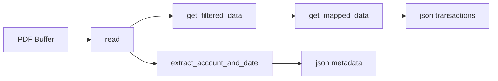

# maybankpdf2json

[](https://pypi.org/project/maybankpdf2json/)
[](https://pypi.org/project/maybankpdf2json/)
[](https://github.com/nordinz7/maybankpdf2json/actions/workflows/publish.yml)
[](https://github.com/nordinz7/maybankpdf2json/blob/main/LICENSE)


A small Python library to extract transactions and statement metadata from Maybank PDF account statements.

## Table of Contents

- [Overview](#overview)
- [Features](#features)
- [Install](#install)
- [Quick Start](#quick-start)
- [API](#api)
- [Output Notes](#output-notes)
- [Architecture](#architecture)
- [Project Structure](#project-structure)
- [Development](#development)
- [Release](#release)
- [Contributing](#contributing)
- [License](#license)

## Overview

This project reads encrypted or unencrypted Maybank statement PDFs and returns one clear output shape:

- `account_number`
- `statement_date`
- `transactions`

## Features

- PDF parsing with password support through `pdfplumber`.
- Stable transaction schema: `date`, `desc`, `trans`, `bal`.
- Single API method: `json()` returns metadata + transactions.
- Statement amount parsing with trailing sign notation:
  - `123.45-` becomes `-123.45`
  - `123.45+` becomes `123.45`
- Consistent date format: `dd/mm/yy`.

## Install

Requires Python 3.8 or newer.

```bash
pip install maybankpdf2json
```

## Quick Start

```python
from maybankpdf2json import MaybankPdf2Json

with open("statement.pdf", "rb") as f:
    extractor = MaybankPdf2Json(f, "your_pdf_password")
  result = extractor.json()
  print(result["account_number"])
  print(result["statement_date"])
  print(result["transactions"][0])
```

If your PDF is not password-protected, pass `None` or omit the password:

```python
with open("statement.pdf", "rb") as f:
    extractor = MaybankPdf2Json(f)
    print(extractor.json())
```

## API

### `MaybankPdf2Json(buffer, pwd)`

- `json()` -> `dict`
  - Returns:
    - `account_number`: statement account number when available
    - `statement_date`: statement date in `dd/mm/yy`
    - `transactions`: list of rows with `date`, `desc`, `trans`, `bal`

If you need pretty JSON, format it in your own project based on your preferred style/tooling.

## Output Notes

- Dates use `dd/mm/yy`.
- Amounts support trailing sign notation from statements:
  - `123.45-` -> `-123.45`
  - `123.45+` -> `123.45`

Example output from `json()`:

```json
{
  "account_number": "162021-851156",
  "statement_date": "30/09/24",
  "transactions": [
    {
      "date": "01/09/24",
      "desc": "BEGINNING BALANCE",
      "trans": 0,
      "bal": 3285.77
    }
  ]
}
```

## Architecture

Processing pipeline:



See [docs/ARCHITECTURE.md](docs/ARCHITECTURE.md) for internals and parser
conventions.

## Project Structure

```text
maybankpdf2json/
├── maybankpdf2json/
│   ├── __init__.py
│   ├── extractor.py
│   └── utils.py
├── tests/
│   ├── test_extractor.py
│   └── test.pdf
├── docs/
│   └── ARCHITECTURE.md
├── CHANGELOG.md
├── CONTRIBUTING.md
├── pyproject.toml
└── setup.py
```

## Development

Install project dependencies:

```bash
make install
```

Run tests:

```bash
make test
```

Alternative test command:

```bash
pytest tests/
```

Current tests are fixture-based and rely on `tests/test.pdf`.

See [CONTRIBUTING.md](CONTRIBUTING.md) for development workflow and [docs/ARCHITECTURE.md](docs/ARCHITECTURE.md) for parser internals.

## Release

See [CHANGELOG.md](CHANGELOG.md) for release history.

Automatic PyPI publishing is configured with GitHub Actions in `.github/workflows/publish.yml`.

One-time setup on PyPI:

1. Open the project on PyPI.
2. Add a Trusted Publisher for this GitHub repository.
3. Use workflow name `publish.yml`.
4. Use environment name `pypi`.

Release flow:

1. Move items from `[Unreleased]` in `CHANGELOG.md` into a new version section.
2. Update the version in `pyproject.toml` and `setup.py`.
3. Commit and push `main`.
4. Create and push a version tag such as `v0.1.53`.
5. GitHub Actions builds the package and publishes it to PyPI automatically.

Example:

```bash
git tag v0.1.53
git push origin v0.1.53
```

Local manual release remains available for maintainers:

```bash
make release
```

This builds and uploads to PyPI using Twine. Run only with valid release credentials.

## Contributing

Contributions are welcome.

- Keep changes focused and small.
- Preserve the public import: `from maybankpdf2json import MaybankPdf2Json`.
- Add user-facing changes to `[Unreleased]` in `CHANGELOG.md`.
- Run tests before opening a pull request.

See [CONTRIBUTING.md](CONTRIBUTING.md) for the full checklist.

## License

MIT. See `LICENSE`.
